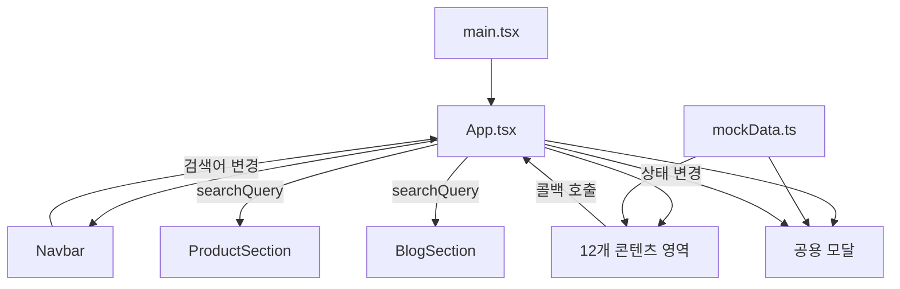

# 백가원 김치 웹사이트 코드 분석

> 분석 기준: `main` 브랜치, 커밋 `ac87da1`  
> 분석일: 2026-08-11

## 1. 한눈에 보는 결론

이 프로젝트는 농업회사법인 양지원식품(주)의 김치 브랜드 **백가원**을 소개하기 위한 반응형 단일 페이지 웹사이트다. React 19, TypeScript, Vite 6, Tailwind CSS 4를 사용하며, 제품 소개·브랜드 스토리·HACCP 공정·회사 연혁·B2B 견적·블로그·후기 등의 콘텐츠를 한 페이지에 배치했다.

현재 상태는 **디자인과 화면 콘텐츠가 갖춰진 프론트엔드 프로토타입**에 가깝다. 제품, 게시글, 후기, 회사 정보는 모두 소스 코드의 목업 데이터이며, 주문·문의·로그인·관리자·결제·데이터베이스 연동은 없다. 프로덕션 빌드는 성공하지만, 실제 버튼을 눌렀을 때 발생할 수 있는 런타임 오류와 성능 문제가 남아 있어 그대로 운영 배포하기에는 보완이 필요하다.

## 2. 기술 구성

| 구분 | 사용 기술 | 역할 |
|---|---|---|
| UI | React 19 | 컴포넌트와 상태 기반 화면 구성 |
| 언어 | TypeScript 5.8 | 제품, 게시글, 후기 등의 데이터 타입 정의 |
| 빌드 | Vite 6 | 개발 서버와 프로덕션 번들 생성 |
| 스타일 | Tailwind CSS 4 | 유틸리티 클래스 기반 반응형 디자인 |
| 아이콘 | lucide-react | 내비게이션, 버튼, 정보 카드 아이콘 |
| 글꼴 | Google Fonts | Noto Sans KR, Noto Serif KR |
| 데이터 | `src/data/mockData.ts` | 회사·제품·연혁·블로그·후기 정적 데이터 |

`@google/genai`, `express`, `dotenv`, `motion`은 `package.json`에 있으나 현재 애플리케이션 코드에서는 사용하지 않는다. `.env.example`의 `GEMINI_API_KEY`, `APP_URL`도 실제 코드에서 읽지 않는다.

## 3. 프로젝트 구조

```text
kimchi-baekgawon/
├─ index.html                 # HTML 진입점, 한글 폰트 로드
├─ package.json               # 실행 스크립트와 의존성
├─ vite.config.ts             # React/Tailwind 플러그인, @ 별칭
├─ tsconfig.json              # TypeScript 설정
├─ metadata.json              # AI Studio용 앱 설명 메타데이터
├─ src/
│  ├─ main.tsx                # React 루트 마운트
│  ├─ App.tsx                 # 전체 섹션과 전역 모달 상태 조정
│  ├─ index.css               # 전역 폰트, 색상, 스크롤바, 페이드인
│  ├─ types.ts                # 제품·게시글·견적·후기 타입
│  ├─ data/mockData.ts        # 정적 콘텐츠 데이터
│  ├─ assets/images/          # 제품/브랜드 이미지 9개
│  └─ components/             # 화면 섹션 및 모달 20개
└─ docs/
   └─ CODE_ANALYSIS.md        # 이 문서
```

소스는 CSS 포함 26개 파일, 약 3,821줄이다. 별도의 서버 디렉터리나 API 라우트는 없다.

## 4. 애플리케이션 구조와 데이터 흐름

`src/main.tsx`가 `App`을 렌더링하고, `App.tsx`가 페이지 섹션 및 공용 모달의 상태를 관리한다. 각 섹션은 부모에게서 콜백을 받아 스크롤 이동 또는 모달 열기를 요청한다.



라우터는 사용하지 않는다. 메뉴 이동은 URL을 바꾸지 않고 `document.getElementById(...).scrollIntoView()`로 해당 섹션까지 스크롤한다. 따라서 제품 상세나 블로그 상세를 직접 링크로 공유할 수 없고, 새로고침하면 모든 UI 상태가 초기화된다.

## 5. 주요 화면과 기능

| 영역 | 컴포넌트 | 주요 기능 |
|---|---|---|
| 상단 메뉴 | `Navbar.tsx` | 데스크톱/모바일 메뉴, 검색창, 드롭다운, 스크롤 시 스타일 변경 |
| 메인 배너 | `HeroBanner.tsx` | 3개 슬라이드, 7초 자동 전환, 섹션/회사/스토어 버튼 |
| 브랜드 철학 | `BrandPhilosophy.tsx` | 자체 영농·고춧가루·저온 보관·유통의 4대 축 소개 |
| 제품 | `ProductSection.tsx` | 카테고리/검색 필터, 제품 카드, 제품 상세 모달 |
| 경쟁력 | `CompetenciesSection.tsx` | 6대 경쟁력과 상세 모달 |
| 제조·품질 | `CraftHaccpSection.tsx` | 제조 단계 탭, 시설 및 인증 모달 |
| 연혁 | `HistorySection.tsx` | 2002년부터 현재까지 타임라인 |
| 국내외 사업 | `BusinessGlobalSection.tsx` | 국내 유통망과 수출 사업 모달 |
| 사회적 가치 | `SocialValueSection.tsx` | CSR 내용과 상세 모달 |
| 구매 유도 | `PurchaseCalloutSection.tsx` | 제품 섹션 및 네이버 스토어 이동 |
| B2B | `B2BSection.tsx` | 월 사용량별 예상 단가 계산, 견적 모달 열기 |
| 블로그 | `BlogSection.tsx` | 카테고리/검색 필터, 상세 모달, 좋아요/공유 UI |
| 후기 | `ReviewsSection.tsx` | 정적 고객 후기 카드 |
| 하단 정보 | `Footer.tsx` | 회사 정보, 섹션 링크, 약관/개인정보 안내 |

### 정적 데이터 규모

- 대표 제품 4개: 포기김치, 겉절이, 총각김치, 깍두기
- 기타 제품명 9개
- 회사 연혁 8개
- 블로그 게시글 1개
- 고객 후기 3개
- 브랜드 핵심 경쟁력 6개

## 6. 실제 동작 수준

### 구현되어 있는 기능

- 반응형 단일 페이지 레이아웃
- 섹션 간 부드러운 스크롤 이동
- 제품 및 블로그 검색/카테고리 필터
- 제품 상세, 회사 소개, HACCP, 연혁 등 다수의 모달
- 월 사용량을 기준으로 한 B2B 예상 단가 계산
- 간단한 질문 기반 김치 추천 UI
- 블로그 좋아요 수 변경, 현재 URL 클립보드 복사

### 화면만 구현된 기능

- B2B 문의 제출은 서버로 전송되지 않는다. 1.2초 후 성공 화면만 표시한다.
- 일반 제품의 구매 버튼은 3.5초 동안 안내 메시지만 보여준다.
- 블로그 좋아요는 메모리에만 반영되며 새로고침하면 사라진다.
- 로그인, 회원가입, 장바구니, 결제, 주문 조회, 관리자 기능은 없다.
- 제품·가격·게시글·후기는 코드 수정과 재배포를 해야 변경할 수 있다.
- `metadata.json`에는 서버 측 Gemini 기능이 명시되어 있으나 실제 AI 호출은 없다.

## 7. 검증 결과

분석 시 의존성을 설치한 뒤 아래 명령을 실행했다.

```bash
pnpm run lint
pnpm run build
```

결과:

- `tsc --noEmit`: 종료 코드 0
- Vite 프로덕션 빌드: 성공
- 변환 모듈: 1,703개
- JavaScript: 346.61KB, gzip 95.11KB
- CSS: 41.32KB, gzip 7.60KB
- 전체 빌드 출력: 약 149.75MB

단, 현재 `@types/react`와 `@types/react-dom`이 없어 TypeScript가 React 컴포넌트의 props를 충분히 검사하지 못한다. 따라서 타입 검사 성공을 “타입 오류가 없다”는 의미로 받아들이면 안 된다.

## 8. 발견된 핵심 문제

### P0 — 운영 전 반드시 수정

1. **`App.tsx`에서 필수 콜백 props가 누락됨**

   - `HeroBanner`: `onOpenCompanyModal`, `onOpenNaverStoreModal` 누락
   - `BrandPhilosophy`: `onOpenCompanyModal` 누락
   - `ProductSection`: `onOpenNaverStoreModal` 누락
   - 해당 버튼을 누르면 `undefined is not a function` 형태의 런타임 오류가 날 수 있다.

2. **조건부 Hook 호출 규칙 위반**

   다음 컴포넌트들은 `if (!isOpen) return null` 또는 `if (!data) return null` 뒤에서 `useState`/`useEffect`를 호출한다.

   - `B2BInquiryModal.tsx`
   - `TasteFinderModal.tsx`
   - `ProductDetailModal.tsx`
   - `BlogDetailModal.tsx`

   닫힘 상태에서 열림 상태로 바뀌면 렌더 간 Hook 개수가 달라져 React 런타임 오류가 발생할 수 있다. Hook을 항상 먼저 호출하거나, 열린 경우에만 별도 내부 컴포넌트를 마운트하는 구조로 바꿔야 한다.

3. **문의와 구매가 실제 업무 시스템에 연결되지 않음**

   B2B 폼에 고객 연락처와 요청 사항을 입력할 수 있지만 어디에도 저장하거나 발송하지 않는다. 운영 전 서버 API, 이메일/CRM 전송, 개인정보 동의와 실패 처리까지 구현해야 한다.

### P1 — 빠른 시일 내 수정 권장

1. **이미지가 지나치게 큼**

   로컬 JPG 9개의 합계가 약 149.38MB이며, 개별 파일은 약 13~25MB, 해상도는 최대 6,720×4,480이다. Vite는 이미지를 자동 축소하지 않아 빌드 결과도 약 149.75MB다. 첫 방문 속도와 모바일 데이터 사용량에 큰 영향을 준다.

   권장: 실제 표시 크기에 맞춰 리사이즈하고 WebP/AVIF로 변환하며, `srcset`, `sizes`, `loading="lazy"`를 적용한다.

2. **React 타입 패키지 누락**

   `@types/react`, `@types/react-dom`을 개발 의존성에 추가해야 props 누락, 이벤트 타입, JSX 관련 오류를 정상적으로 검출할 수 있다.

3. **네이버 스토어 URL 불일치**

   `mockData.ts`에는 `https://smartstore.naver.com/baekgawon`이 있지만 `NaverStoreModal.tsx`는 일반 홈인 `https://smartstore.naver.com`으로 연결한다. 회사 정보의 단일 URL을 재사용하는 편이 안전하다.

4. **김치 추천 로직이 답변 일부를 사용하지 않음**

   추천 과정에서 숙성 취향을 질문하고 상태로 저장하지만, 실제 필터는 용도와 매운맛만 사용한다. B2B 선택도 B2B 제품이 데이터에 없어서 기대한 추천이 나오지 않을 수 있다.

5. **“전체 제품 보기” 상태가 화면에 영향을 주지 않음**

   `showAllProductsView`는 버튼 문구만 바꾸고 제품 목록이나 기타 제품 표시 방식을 변경하지 않는다.

### P2 — 품질 개선

- 상단 메뉴의 활성 섹션은 메뉴로 이동할 때만 갱신되고 사용자의 직접 스크롤은 반영하지 않는다.
- 모달에 ESC 닫기, 포커스 트랩, `role="dialog"`, `aria-modal`, 버튼 `aria-label` 등이 부족하다.
- 일부 모달 배경은 클릭해도 닫히지 않아 UI 동작이 일관되지 않다.
- 검색은 제품과 블로그에만 적용되지만 입력창 문구는 HACCP·연혁까지 검색되는 것처럼 보인다.
- 제품과 게시글 상세가 URL에 반영되지 않아 공유, 뒤로 가기, 검색엔진 노출에 불리하다.
- 원격 Unsplash 이미지와 Google Fonts에 의존하므로 외부 네트워크 장애 시 일부 시각 요소가 표시되지 않는다.
- SEO용 설명, Open Graph, 구조화 데이터, sitemap, robots 설정이 없다.
- 자동 테스트와 CI 설정이 없다.
- 사용하지 않는 의존성과 환경변수는 제거하거나 실제 기능을 구현해 관리 범위를 줄이는 것이 좋다.

## 9. 권장 개선 순서

1. React 타입 패키지를 추가하고 누락된 props를 연결한다.
2. 4개 모달의 조건부 Hook 호출을 수정하고 주요 버튼을 실제 브라우저에서 점검한다.
3. 모든 로컬 이미지를 리사이즈·압축해 빌드 용량을 크게 줄인다.
4. B2B 문의 API와 이메일/CRM 연동, 개인정보 동의 및 서버 검증을 구현한다.
5. 제품/게시글 데이터를 CMS 또는 백엔드 API로 분리한다.
6. 주문은 스마트스토어의 정확한 상품 URL로 연결하거나 자체 결제 흐름을 구현한다.
7. 접근성, SEO, 에러 처리, 분석 도구, 자동 테스트를 추가한다.

## 10. 로컬 실행 방법

Node.js가 설치된 환경에서 저장소 루트에서 실행한다.

```bash
npm install
npm run dev
```

개발 서버는 `package.json` 설정상 `http://localhost:3000`에서 실행된다.

프로덕션 검증:

```bash
npm run lint
npm run build
npm run preview
```

현재 앱은 환경변수 없이도 화면을 실행할 수 있다. `.env.example`의 값은 코드에서 사용하지 않는다.

## 11. 운영 전 체크리스트

- [ ] 누락된 4개 콜백 props 연결
- [ ] 조건부 Hook 호출 4곳 수정
- [ ] `@types/react`, `@types/react-dom` 추가 후 타입 검사 재실행
- [ ] 제품/브랜드 이미지 압축 및 지연 로딩
- [ ] 네이버 스마트스토어 실제 URL 검증
- [ ] B2B 문의 저장·알림 API 구현
- [ ] 개인정보 수집 동의와 처리방침 정식 페이지 준비
- [ ] 모바일/데스크톱 주요 브라우저 테스트
- [ ] 키보드 탐색과 모달 접근성 보완
- [ ] SEO/Open Graph/구조화 데이터 추가
- [ ] 회사 정보, 인증, 가격, 연혁, 수출 실적의 사실관계 최종 검수
- [ ] 배포 환경과 장애 모니터링 구성

