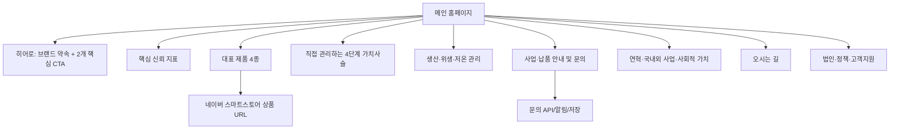

# 백가원 메인 홈페이지 개선 PRD

> 문서 상태: Draft v1.0  
> 작성일: 2026-08-11  
> 대상 프로젝트: `kimchi-baekgawon`  
> 기준 자료: `docs/img/baekgawon_homepage_content.md`, `docs/img` 원본 사진 11장, `docs/CODE_ANALYSIS.md`, 현행 React 구현

## 1. 문서 목적

이 문서는 백가원 메인 홈페이지를 단순한 브랜드 소개용 프로토타입에서 **제품 구매와 사업·납품 문의를 실제로 만들어 내는 신뢰 중심 홈페이지**로 개선하기 위한 제품 요구사항을 정의한다.

핵심 방향은 다음 두 가지다.

1. 일반 고객에게는 정갈하고 먹음직스러운 제품 경험을 제공해 네이버 스토어 구매로 연결한다.
2. 식당·급식·유통 파트너에게는 자체 영농, 고춧가루 생산, 저온 보관, 생산시설 및 유통 역량을 실제 사진과 검증 가능한 정보로 보여주고 문의로 연결한다.

## 2. 배경과 현재 문제

현행 홈페이지는 브랜드, 제품, 생산, 연혁, B2B 등 필요한 콘텐츠를 폭넓게 담고 있지만 다음 문제가 있다.

- 외부 스톡 이미지와 자사 원본 사진이 혼재해 브랜드 고유성이 약하다.
- 12개 이상의 섹션이 비슷한 밀도로 이어져 핵심 메시지와 전환 경로가 분산된다.
- 제품 구매, B2B 문의가 실제 시스템과 연결되지 않고 성공 화면만 표시된다.
- 일부 필수 콜백 누락과 조건부 Hook 호출 문제로 버튼·모달에서 런타임 오류가 날 수 있다.
- 제품 이미지 9개만으로도 약 149MB여서 모바일 로딩 성능이 매우 불리하다.
- 제품 가격·중량·인증·수출 등의 공개 정보가 최신인지 확정되지 않았다.
- 검색, 전체 제품 보기, 맞춤 추천 등 일부 기능이 표시된 설명대로 완전히 동작하지 않는다.
- 상세 콘텐츠가 URL로 구분되지 않아 공유, 검색엔진 노출, 뒤로 가기 경험이 약하다.

## 3. 브랜드 시스템 해석

제공된 콘텐츠와 사진을 기준으로 정리한 백가원의 브랜드 시스템이다. 공식 CI 가이드가 제공된 것은 아니므로 색상값과 타이포그래피는 본 프로젝트를 위한 제안값이며, 공식 브랜드 규정이 별도로 있다면 그 규정을 우선한다.

### 3.1 브랜드 본질

| 항목 | 정의 |
|---|---|
| 브랜드 | 백가원 |
| 운영 법인 | 농업회사법인 양지원식품(주) |
| 시작 | 2002년 대성종합식품 |
| 핵심 약속 | 원재료부터 생산과 유통까지 직접 관리하는 정직한 전통식품 |
| 대표 문장 | 백년을 이어가는 전통식품, 백가원 |
| 고객 효익 | 믿고 선택할 수 있는 맛, 안정적인 품질, 지속 가능한 공급 |
| 차별화 근거 | 자체 영농, 자체 고춧가루 생산, 저온 보관, 자체 유통망, 연구개발, 국내외 유통 |
| 브랜드 성격 | 정직함, 따뜻함, 단정함, 책임감, 전문성 |

### 3.2 포지셔닝

백가원은 “감성적인 프리미엄 김치”만을 말하는 브랜드가 아니다. 직접 관리하는 생산·보관·유통 인프라가 핵심 자산이다. 따라서 홈페이지는 다음 두 층을 동시에 보여줘야 한다.

- **식탁의 감성:** 따뜻한 아이보리 패브릭, 흰 도자기, 김치의 붉은색과 채소의 녹색, 정갈한 상차림
- **생산의 증거:** 실제 영농지, 고춧가루 설비, 위생 공간, 저온 저장고, 공장 외관과 물류 환경

감성만 강조하면 일반 김치 쇼핑몰과 차별화되지 않고, 시설만 강조하면 소비자에게 차갑고 산업적인 인상을 준다. 두 요소를 “정직한 맛은 직접 관리하는 과정에서 나온다”는 하나의 이야기로 연결한다.

### 3.3 메시지 계층

1. **최상위 메시지:** 백년을 이어가는 전통식품, 백가원
2. **브랜드 약속:** 원재료부터 생산과 유통까지 직접 관리합니다.
3. **증명 요소:** 2002년 시작, 자체 영농, 자체 고춧가루 생산, 저온 보관, 자체 유통망
4. **소비자 행동:** 제품을 보고 온라인에서 구매한다.
5. **사업자 행동:** 납품 조건을 확인하고 상담을 신청한다.

### 3.4 문체 원칙

- 과장된 최상급 표현보다 사실과 근거를 먼저 제시한다.
- 어려운 제조 용어보다 고객이 이해할 수 있는 결과를 설명한다.
- 전통은 오래되었다는 주장만 하지 않고 현재의 품질관리와 연결한다.
- 인증, 수출, 국내산 원료, 가격은 검증된 범위에서만 표현한다.
- CTA는 “자세히 보기”보다 “제품 보기”, “납품 상담 신청”처럼 다음 행동이 명확해야 한다.

### 3.5 제안 비주얼 토큰

| 용도 | 제안값 | 의미 |
|---|---|---|
| 배경 아이보리 | `#F7F2E8` | 패브릭과 한식 상차림의 온기 |
| 종이색 | `#FFFDF8` | 콘텐츠 가독성과 여백 |
| 김치 레드 | `#B6402B` | 제품의 생동감과 핵심 CTA |
| 짙은 장독 그린 | `#24372B` | 신뢰, 농업, 생산 기반 |
| 채소 그린 | `#607A49` | 원재료와 영농 |
| 먹색 | `#242321` | 본문 및 제목 |
| 회갈색 | `#746E64` | 보조 설명 |

타이포그래피는 현재 적용된 Noto Serif KR과 Noto Sans KR 조합을 유지한다. 제목에는 세리프를 제한적으로 사용하고, 본문·폼·수치·버튼에는 산세리프를 사용한다. 한 화면에서 영문 대문자와 자간을 과도하게 사용하지 않는다.

## 4. 제공 이미지 분석과 활용 계획

원본 11장은 모두 4,297px 이상 고해상도이며 개별 용량이 약 12.7~30.9MB다. 이미지 내용은 브랜드 방향과 잘 맞지만 웹 원본으로 직접 사용하면 안 된다. 원본은 보존하고, 배포용 파생 이미지를 별도로 생성한다.

### 4.1 이미지별 매핑

| 파일 | 확인된 내용 | 홈페이지 활용 | 비고 |
|---|---|---|---|
| [20250424 백가원 001.jpg](<./img/20250424 백가원 001.jpg>) | 아이보리 천 위 여러 종류의 김치를 내려다본 전체 상차림 | 메인 히어로 또는 제품 다양성 섹션 | 세로 사진이므로 데스크톱 전체 배경보다 좌우 분할 레이아웃 권장 |
| [20250424 백가원_ 포기김치 009.jpg](<./img/20250424 백가원_ 포기김치 009.jpg>) | 포기김치 근접 연출 | 대표 제품 카드, 포기김치 상세 | 질감과 붉은색이 선명한 핵심 제품 이미지 |
| [20250424 백가원_겉절이 012.jpg](<./img/20250424 백가원_겉절이 012.jpg>) | 흰 접시의 겉절이와 여백 있는 연출 | 겉절이 카드, 신선함 메시지 | 상단 여백에 짧은 카피 배치 가능 |
| [20250424 백가원_ 총각김치 006.jpg](<./img/20250424 백가원_ 총각김치 006.jpg>) | 총각김치와 깍두기가 함께 담긴 연출 | 무김치 카테고리 또는 총각김치 카드 | 단독 총각김치로 오해하지 않도록 캡션 검수 필요 |
| [20250424 백가원_깍두기 014.jpg](<./img/20250424 백가원_깍두기 014.jpg>) | 깍두기 단독 연출 | 깍두기 제품 카드 | 피사체가 하단에 있어 텍스트 오버레이보다 카드 이미지에 적합 |
| [20250424 백가원 사진 (136).jpg](<./img/20250424 백가원 사진 (136).jpg>) | 넓게 펼쳐진 배추밭 | 자체 영농 경쟁력 | 넓은 가로 구도와 하늘 여백 활용 가능 |
| [20250424 백가원 사진 (205).jpg](<./img/20250424 백가원 사진 (205).jpg>) | 고춧가루 관련 설비가 배치된 작업 공간 | 자체 고춧가루 생산 | 설비 명칭·공정 설명은 담당자 확인 후 표기 |
| [20250424 백가원 사진 (35).jpg](<./img/20250424 백가원 사진 (35).jpg>) | 냉각 설비와 적재 상자가 있는 저온 보관 공간 | 저온 보관 및 신선도 관리 | 정확한 온도 범위는 운영 자료 확인 필요 |
| [20250424 백가원 사진 (124) (1).jpg](<./img/20250424 백가원 사진 (124) (1).jpg>) | 위생복 보관함, 손 세정대, 스테인리스 시설 | 위생관리 및 작업 전 준비 환경 | “HACCP 인증” 표시는 유효 인증 확인 후 사용 |
| [20250424 백가원 사진 (190).jpg](<./img/20250424 백가원 사진 (190).jpg>) | 백가원 표지와 공장 전경 | 회사 소개, 오시는 길, 기업 신뢰 | 브랜드 식별이 가장 명확한 외관 사진 |
| [20250424 백가원 사진 (147).jpg](<./img/20250424 백가원 사진 (147).jpg>) | 공장 측면, 차량과 적재 팔레트 | 유통·물류 역량 | 차량 번호판 노출 여부와 초상권·개인정보 검토 필요 |

### 4.2 이미지 처리 요구사항

- 파일명은 원본 보존 후 배포본만 의미 기반 영문명으로 만든다. 예: `hero-kimchi-table`, `farm-cabbage-field`, `facility-cold-storage`.
- AVIF를 우선 제공하고 WebP fallback을 둔다.
- 히어로: 데스크톱 1,920px 이하 350KB 목표, 모바일 960px 이하 180KB 목표.
- 섹션 가로 이미지: 1,280px 이하 220KB 목표.
- 제품 카드: 720px 이하 120KB 목표.
- `srcset`과 `sizes`를 사용해 화면 크기에 맞는 이미지만 전송한다.
- 첫 화면 핵심 이미지만 우선 로드하고 나머지는 `loading="lazy"`를 적용한다.
- 이미지별 초점 좌표를 관리해 모바일 크롭에서도 제품이나 시설 핵심이 잘리지 않게 한다.
- 사진의 색온도는 아이보리·레드·그린이 자연스럽게 이어지도록 통일하되 제품 색을 과장하지 않는다.
- 사진마다 내용을 설명하는 한국어 대체 텍스트를 작성한다.

## 5. 제품 목표와 성공 지표

### 5.1 목표

- 백가원의 “직접 관리하는 정직한 전통식품” 포지셔닝을 첫 화면에서 이해시킨다.
- 제품 탐색에서 네이버 스마트스토어로 이어지는 경로를 단순화한다.
- B2B 잠재 고객이 생산·보관·유통 근거를 확인한 뒤 상담을 제출하게 한다.
- 자사 사진 중심의 일관된 브랜드 경험으로 신뢰도를 높인다.
- 모바일 환경에서 빠르고 안정적으로 사용할 수 있게 한다.

### 5.2 핵심 지표

초기 기준값을 먼저 수집하고 배포 후 4주 단위로 비교한다.

| 분류 | 지표 | 1차 목표 |
|---|---|---|
| 구매 | 스마트스토어 CTA 클릭률 | 방문 세션 대비 8% 이상 |
| B2B | 유효 문의 완료율 | 문의 폼 진입 대비 35% 이상 |
| 탐색 | 대표 제품 카드 클릭률 | 방문 세션 대비 15% 이상 |
| 브랜드 | 경쟁력/생산 섹션 도달률 | 방문 세션 대비 45% 이상 |
| 성능 | 모바일 LCP | 2.5초 이하 |
| 성능 | CLS | 0.1 이하 |
| 안정성 | 주요 CTA JavaScript 오류 | 0건 |
| 품질 | 문의 API 성공률 | 99% 이상 |

## 6. 주요 사용자

### Persona A — 가정용 구매 고객

- 맛있고 믿을 수 있는 김치를 빠르게 고르고 싶다.
- 사진, 중량, 원재료, 보관법, 가격과 배송 정보를 중요하게 본다.
- 상세 설명을 길게 읽기보다 대표 제품을 비교한 뒤 스토어로 이동한다.

### Persona B — 식당·급식 담당자

- 일정한 맛과 공급 안정성, 납품 가능 지역, 최소 수량을 확인하고 싶다.
- 생산시설, 위생관리, 저온 보관, 유통 역량을 신뢰 근거로 본다.
- 전화 외에도 기록이 남는 온라인 상담을 원한다.

### Persona C — 유통·수출 파트너

- 생산 규모, 제품 구성, OEM/ODM 가능 여부, 인증 및 수출 경험을 찾는다.
- 검증 가능한 회사 자료와 담당자 연결이 필요하다.

## 7. 범위

### 7.1 MVP 포함

- 메인 페이지 정보 구조 및 비주얼 전면 개선
- 제공된 자사 사진 11장의 최적화 및 적용
- 반응형 상단 메뉴와 섹션 이동
- 대표 제품 4종 및 제품별 스토어 딥링크
- 브랜드 경쟁력과 생산·품질 증거 섹션
- B2C 구매 CTA와 B2B 문의 CTA 분리
- 실제 동작하는 B2B 문의 API 및 전송 결과 처리
- 회사 연혁, 국내외 사업, 사회적 가치의 요약 콘텐츠
- 주소, 지도, 전화 연결
- SEO, 접근성, 분석 이벤트, 오류 모니터링
- 기존 P0 런타임 오류와 이미지 성능 문제 수정

### 7.2 MVP 제외

- 자체 회원가입·로그인
- 자체 장바구니·결제·주문 관리
- 정기구독 결제
- 완전한 다국어/해외몰
- ERP 및 재고 실시간 연동
- AI 김치 추천
- 운영자 CMS 전체 구축

제품·콘텐츠 변경이 잦다면 후속 단계에서 Headless CMS를 도입한다.

## 8. 개선된 정보 구조



상단 메뉴는 `백가원`, `제품`, `생산과 품질`, `사업·납품`, `오시는 길`로 단순화하고 우측에 `온라인 구매`와 `납품 문의`를 고정한다. 모바일에서는 구매와 문의가 화면 하단 고정 CTA로 노출될 수 있다.

## 9. 화면별 상세 요구사항

### 9.1 헤더

- 초기에는 아이보리 배경, 스크롤 후에는 높이를 줄인 고정 헤더를 사용한다.
- 로고 클릭 시 페이지 최상단으로 이동한다.
- 현재 보고 있는 섹션을 `IntersectionObserver`로 감지해 메뉴 활성 상태를 갱신한다.
- `온라인 구매`는 스마트스토어 정확한 URL로, `납품 문의`는 폼으로 연결한다.
- 모바일 메뉴는 키보드 포커스 관리, ESC 닫기, 배경 스크롤 잠금을 지원한다.

### 9.2 히어로

- 메인 카피: **백년을 이어가는 전통식품, 백가원**
- 보조 카피: **2002년부터 원재료, 생산, 보관과 유통을 직접 관리해 믿을 수 있는 전통의 맛을 만듭니다.**
- 1차 CTA: `대표 제품 보기`
- 2차 CTA: `사업·납품 문의`
- 보조 링크: `네이버 스토어 바로가기`
- 자동 슬라이드는 제거하거나 최대 2장으로 제한한다. 핵심 메시지가 시간에 따라 바뀌지 않게 한다.
- 대표 상차림 사진은 세로 원본의 특성을 살린 좌우 분할 또는 프레임형 레이아웃으로 사용한다.
- 첫 화면 안에 `SINCE 2002`, `자체 영농`, `자체 고춧가루 생산`, `저온 보관·유통` 증거를 짧게 노출한다.

### 9.3 핵심 신뢰 스트립

- 히어로 바로 아래에 4개의 검증 가능한 핵심 사실을 배치한다.
- 숫자나 인증 표현은 담당자 확인 자료가 있는 경우에만 사용한다.
- 아이콘만으로 의미를 전달하지 않고 텍스트 라벨을 함께 제공한다.

### 9.4 대표 제품

- 포기김치, 겉절이, 총각김치, 깍두기 4종을 동일한 카드 체계로 표시한다.
- 카드 필수 정보: 제품명, 한 줄 특징, 판매 중량, 가격 표시 정책, 원재료/원산지 요약, 보관법, 스토어 링크.
- 가격을 홈페이지에 표시하려면 중량·구성·배송비 조건을 함께 표시한다. 확인 전에는 `스토어에서 가격 확인`으로 처리한다.
- 카드 클릭은 URL이 있는 제품 상세 또는 정확한 스마트스토어 상품 페이지로 이동한다.
- “전체 제품 보기”는 실제 제품 목록 페이지로 연결하며 문구만 바뀌는 토글은 사용하지 않는다.
- 제품 이미지의 크롭 비율과 접시 크기를 시각적으로 통일한다.

### 9.5 브랜드 소개

- 2002년 시작과 “전통의 맛을 오늘의 기준으로 만든다”는 메시지를 짧게 설명한다.
- 장문의 회사 소개는 상세 페이지로 분리한다.
- 공장 전경 사진과 회사명·주소를 연결해 실재하는 제조 기업이라는 인상을 강화한다.

### 9.6 직접 관리하는 가치사슬

4개 단계의 연속적인 스토리로 보여준다.

1. 자체 영농 — 배추밭 사진
2. 자체 고춧가루 생산 — 설비 사진
3. 위생적인 제조·품질관리 — 위생 공간 사진
4. 저온 보관과 안정적 공급 — 저온 저장고 및 물류 사진

각 단계는 “무엇을 보유한다”에서 끝내지 않고 고객 가치로 연결한다. 예: “저온 보관시설 운영 → 원재료와 제품의 신선도를 안정적으로 관리”.

### 9.7 제조 및 품질관리

- 실제 시설 사진을 사용하고 스톡 이미지는 제거한다.
- HACCP, 인증, 온도 범위, 검사 항목은 최신 증빙 확인 후 공개한다.
- 인증서가 확인되면 발급기관, 인증 대상, 인증번호, 유효기간을 접근 가능한 텍스트로 제공한다.
- 생산 공정은 담당자 검수된 단계만 표시한다.

### 9.8 B2B 사업·납품

- 대상 업종, 가능 제품, 최소 수량, 납품 지역, 주기, 샘플 정책을 요약한다.
- 확정되지 않은 단가는 계산기로 추정하지 않는다. 단가 계산기는 공식 가격표가 있을 때만 유지한다.
- 폼 필수 항목: 업체명, 담당자명, 연락처, 이메일 또는 회신 수단, 희망 제품, 예상 수량, 납품 지역, 희망 일정, 문의 내용, 개인정보 수집 동의.
- 제출 시 서버 검증, 중복 방지, 스팸 방지, 성공/실패 메시지, 담당자 알림, 문의 이력 저장을 구현한다.
- 전화 연결 `tel:041-588-0557`을 보조 수단으로 제공한다.

### 9.9 연혁·국내외 사업·사회적 가치

- 메인에서는 핵심 연혁 4개만 보여주고 전체 연혁은 상세 페이지 또는 펼침 영역으로 제공한다.
- 수출 국가와 시점은 최신 자료를 확인한 범위에서만 표시한다.
- 사회공헌 내용은 기관명, 일자, 활동 사진 등 근거가 있을 때 구체화한다.
- 세 섹션을 각각 길게 늘리지 않고 “시간, 확장, 책임”의 한 묶음으로 구성한다.

### 9.10 오시는 길과 푸터

- 주소: 충남 천안시 서북구 성환읍 율금1길 187
- 대표번호: 041-588-0557
- `지도에서 보기`, `전화 문의` 버튼을 제공한다.
- 지도는 초기 로딩을 막지 않도록 클릭 후 로드하거나 정적 지도 이미지를 사용한다.
- 푸터에 법인명, 대표자, 개인정보보호책임자, 사업자등록번호, 통신판매업 신고번호를 표시한다.
- 이용약관과 개인정보처리방침은 `alert`가 아니라 고유 URL의 정식 문서로 제공한다.

## 10. 기능 요구사항

| ID | 요구사항 | 우선순위 | 수용 기준 |
|---|---|---|---|
| FR-01 | 모든 주요 CTA가 정의된 목적지로 이동 | Must | 데스크톱·모바일에서 JS 오류 없이 동작 |
| FR-02 | 제품별 스마트스토어 딥링크 | Must | 정확한 상품 URL을 새 창으로 열고 이벤트 기록 |
| FR-03 | B2B 문의 서버 전송 | Must | 성공 시 문의 ID 제공, 실패 시 재시도 안내 |
| FR-04 | 반응형 내비게이션 | Must | 360px~1,920px에서 메뉴 사용 가능 |
| FR-05 | 섹션 활성 상태 반영 | Should | 직접 스크롤 시 메뉴 상태 자동 갱신 |
| FR-06 | 제품 데이터 관리 | Must | 가격·중량·원산지 미확정 필드는 공개 차단 가능 |
| FR-07 | 모달/상세 URL 지원 | Should | 공유·뒤로 가기·새로고침 동작 보장 |
| FR-08 | 분석 이벤트 기록 | Must | CTA, 제품, 문의 퍼널 이벤트 수집 |
| FR-09 | 오류 모니터링 | Must | 프론트 오류와 문의 API 오류 추적 |
| FR-10 | 관리자 확인용 문의 내역 | Should | 최소 이메일/시트/CRM 중 한 곳에 안전하게 보관 |

## 11. 비기능 요구사항

### 성능

- 모바일 Lighthouse Performance 85점 이상을 1차 목표로 한다.
- LCP 2.5초 이하, INP 200ms 이하, CLS 0.1 이하를 목표로 한다.
- 초기 화면 이미지·폰트·CSS·JS 합계를 가능한 1MB 이내로 관리한다.
- 사용하지 않는 `@google/genai`, `express`, `dotenv`, `motion` 등은 실제 용도가 없다면 제거한다.

### 접근성

- WCAG 2.2 AA 수준을 목표로 한다.
- 모든 기능은 키보드로 사용할 수 있어야 한다.
- 모달은 포커스 트랩, ESC 닫기, 닫은 후 원래 버튼으로 포커스 복귀를 제공한다.
- 텍스트와 배경 명도 대비는 일반 텍스트 4.5:1 이상을 유지한다.
- 아이콘 버튼, 슬라이드 제어, 메뉴 버튼에 접근 가능한 이름을 제공한다.
- `prefers-reduced-motion` 사용자는 자동 전환과 큰 모션을 비활성화한다.

### SEO

- 한국어 고유 제목과 메타 설명을 작성한다.
- Open Graph 이미지에는 대표 상차림 사진을 최적화해 사용한다.
- Organization, LocalBusiness, Product, Breadcrumb 구조화 데이터를 검토한다.
- 제품 상세에 고유 URL, canonical, sitemap을 제공한다.
- 인증되지 않은 리뷰 점수나 가격을 구조화 데이터에 넣지 않는다.

### 보안·개인정보

- 문의 입력값을 서버에서 다시 검증하고 HTML을 무해화한다.
- 전송 구간은 HTTPS를 사용한다.
- 개인정보 수집 목적, 항목, 보유기간, 동의 거부 권리를 폼에 명시한다.
- 문의 데이터 접근 권한과 삭제 정책을 운영 절차로 정의한다.
- CAPTCHA 또는 속도 제한으로 자동 제출을 방지한다.

## 12. 데이터 모델 제안

### Product

```ts
interface Product {
  id: string;
  slug: string;
  name: string;
  category: 'cabbage' | 'radish' | 'water' | 'special';
  shortDescription: string;
  weightOptions: Array<{ label: string; price?: number }>;
  originSummary: string;
  allergens?: string[];
  storageMethod: string;
  shelfLife?: string;
  imageSet: ResponsiveImageSet;
  storeUrl: string;
  status: 'draft' | 'active' | 'sold_out' | 'discontinued';
  verifiedAt: string;
}
```

### B2BInquiry

```ts
interface B2BInquiry {
  id: string;
  companyName: string;
  contactName: string;
  phone: string;
  email?: string;
  products: string[];
  expectedVolume: string;
  deliveryRegion: string;
  desiredSchedule?: string;
  notes?: string;
  privacyConsent: true;
  createdAt: string;
  status: 'received' | 'contacted' | 'qualified' | 'closed';
}
```

## 13. 분석 이벤트

| 이벤트 | 주요 속성 |
|---|---|
| `hero_cta_click` | `cta_type`, `device` |
| `product_card_view` | `product_id`, `position` |
| `product_card_click` | `product_id`, `position` |
| `store_outbound_click` | `product_id`, `source_section`, `target_url` |
| `b2b_form_start` | `source_section` |
| `b2b_form_error` | `field_name`, `error_type` |
| `b2b_form_submit` | `product_count`, `volume_range`, `region` |
| `b2b_form_success` | `inquiry_id` |
| `phone_click` | `source_section` |
| `map_click` | `source_section` |

전화번호, 이메일, 이름, 문의 내용 등 개인정보는 분석 이벤트에 포함하지 않는다.

## 14. 콘텐츠 검수 게이트

다음 정보는 담당자가 확인하기 전까지 배포 데이터에서 `draft` 상태로 둔다.

- 겉절이 46,000원/50,000원의 중량 및 구성 차이
- 포기김치·총각김치·깍두기의 실제 판매 중량과 최신 가격
- 배송비와 도서산간 정책
- 원재료명, 원산지, 알레르기 유발 물질
- 보관 방법과 소비기한
- 판매 중/품절/단종 상태
- 네이버 스토어 및 제품별 정확한 URL
- HACCP 등 인증 대상·번호·유효기간
- 중국·홍콩 등 최신 수출 현황
- B2B 최소 수량, 납품 지역, 배송 주기, 샘플 정책
- 상담 운영시간과 문의 담당 부서
- 시설 사진별 정확한 공간·설비·공정 명칭

## 15. 기술 선행 작업

메인 개선 전에 다음 문제를 먼저 해결한다.

1. `@types/react`, `@types/react-dom`을 추가해 JSX props 타입 검사를 정상화한다.
2. `App.tsx`에서 HeroBanner, BrandPhilosophy, ProductSection의 누락 콜백을 연결한다.
3. B2BInquiryModal, TasteFinderModal, ProductDetailModal, BlogDetailModal의 조건부 Hook 호출을 수정한다.
4. 원본 이미지를 웹용 파생 이미지로 바꾸고 기존 149MB 이미지 번들을 제거한다.
5. 임시 성공 메시지로 끝나는 구매·문의 흐름을 실제 URL/API에 연결한다.
6. `smartstore.naver.com` 일반 홈 대신 백가원 및 제품별 정확한 URL을 사용한다.

## 16. QA와 출시 수용 기준

### 기능

- [ ] 헤더, 히어로, 제품, B2B, 지도, 전화 CTA가 모두 올바르게 동작한다.
- [ ] 제품 4종의 사진·제품명·중량·가격 정책·스토어 URL이 담당자 승인 데이터와 일치한다.
- [ ] B2B 문의가 서버에 저장되고 담당자에게 알림이 전달된다.
- [ ] 실패, 중복 제출, 네트워크 단절, 필수값 누락 상황이 처리된다.
- [ ] 브라우저 뒤로 가기와 새로고침 후에도 상세 URL이 유효하다.

### 반응형·브라우저

- [ ] 360px, 390px, 768px, 1,024px, 1,440px 기준으로 레이아웃을 확인한다.
- [ ] 최신 Chrome, Edge, Safari, 모바일 Safari, Android Chrome을 확인한다.
- [ ] 모바일에서 가로 스크롤이나 잘린 CTA가 없다.

### 접근성

- [ ] 키보드만으로 메뉴, 제품, 모달, 문의 폼을 사용할 수 있다.
- [ ] 포커스 표시가 명확하고 논리적인 순서로 이동한다.
- [ ] 모든 콘텐츠 이미지에 적절한 대체 텍스트가 있다.
- [ ] 자동 움직임을 정지하거나 줄일 수 있다.

### 성능·안정성

- [ ] 모바일 LCP 2.5초 이하를 실사용 환경에서 확인한다.
- [ ] 첫 화면에서 원본 대용량 JPG가 다운로드되지 않는다.
- [ ] 콘솔 오류와 미처리 Promise 오류가 없다.
- [ ] 주요 CTA와 문의 API에 모니터링이 연결되어 있다.

## 17. 단계별 실행안

### Phase 0 — 사실 확인 및 기술 안정화

- 가격, 인증, 원산지, 수출, B2B 조건, 스토어 URL 확정
- P0 런타임 오류 수정
- React 타입 검사 정상화
- 이미지 최적화 파이프라인 구축

### Phase 1 — MVP 메인 개편

- 헤더·히어로·대표 제품·경쟁력·품질·B2B·오시는 길 구현
- 자사 사진 11장 적용
- 문의 API, 개인정보 동의, 분석 이벤트 구현
- 접근성·SEO·성능 QA 후 출시

### Phase 2 — 전환 개선

- 제품 상세 URL과 전체 제품 목록
- 후기, FAQ, 인증 자료, 전체 연혁
- CTA 문구와 섹션 순서 A/B 테스트
- 문의 운영 데이터 기반 폼 단순화

### Phase 3 — 운영 확장

- CMS 도입
- 영어/중국어 등 다국어 검토
- OEM/ODM 및 수출 파트너 전용 자료실
- ERP/CRM/재고 연동 검토

## 18. 주요 리스크와 대응

| 리스크 | 영향 | 대응 |
|---|---|---|
| 가격·인증·수출 정보가 오래됨 | 신뢰 및 법적 위험 | 콘텐츠 검수 책임자와 승인일 기록 |
| 원본 이미지 용량 과다 | 이탈률과 검색 노출 악화 | AVIF/WebP 파생본과 성능 예산 적용 |
| B2C와 B2B 메시지 혼재 | CTA 집중도 저하 | 첫 화면에서 행동을 분리하고 섹션별 전환 설계 |
| 문의 데이터 미처리 | 영업 기회 손실 | 저장, 알림, 상태 관리, 오류 모니터링 구성 |
| 인증 표현 오용 | 소비자 오인 | 인증번호·대상·유효기간 검수 후 공개 |
| 시설 사진의 설명 오류 | 전문성 저하 | 현장 담당자가 파일별 캡션을 최종 승인 |

## 19. 결정이 필요한 항목

- 홈페이지에서 가격을 직접 관리할지, 스마트스토어에서만 관리할지
- 제품별 스마트스토어 딥링크 목록
- B2B 문의를 받을 시스템: 이메일, Google Sheet, CRM 또는 자체 관리자
- 공식 로고 원본과 CI 컬러·최소 여백 규정 존재 여부
- 현재 유효한 인증서와 공개 가능한 생산·수출 자료
- 공장 및 시설 사진에 노출된 차량 번호판 등 비식별 처리 필요 여부
- 메인 공개 대상 제품과 판매 중단 제품 목록
- 지도 서비스 제공자와 개인정보·쿠키 정책

---

이 PRD는 제공된 브랜드 콘텐츠와 사진을 기준으로 한 실행 초안이다. 공개 문구와 제품·인증·사업 정보는 반드시 백가원 담당자의 최신 자료 승인 후 확정한다.
